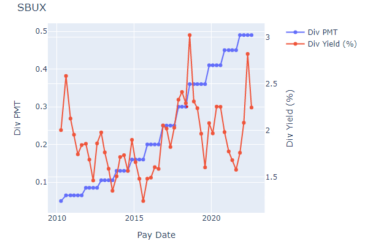
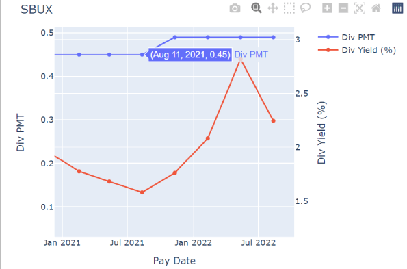

# Data Analytics Portfolio  
  
## About Me  
Hi! I bring value through analytic skills (Python, Tableau, Excel) and system expertise (Workday, Greenhouse).  
I combine these skillsets to align the goals of people operations with business values.  
  
Feel free to contact me on [LinkedIn](https://www.linkedin.com/in/leoykim/)!  

## Projects
#### 1. [Recruiting Activity Report](https://github.com/leoykim/TA-Jobs-Summary-Workday-Cleanup)  
* Designed to automate data clean up process of Workday report:
  * Conditional filters
  * Xlookup
  * Adjust data types
  * Correct text
  * Rearrange columns
* Exports an updated Excel file
  
*Tools*: Python (pandas, numpy)  
  
   
  
#### 2. [Recruiting Activity Dashboard](https://public.tableau.com/views/RecruitingDashboard_16517993039310/ActiveReq?:language=en-US&:display_count=n&:origin=viz_share_link)  
* Designed dashboard to visualize recruiting activity
* Categorized by division to review overall summary
* Broken down by recruiters to view & manage workload
* 2nd page displays all reqs for each recruiter ([link](https://public.tableau.com/views/RecruitingDashboard_16517993039310/ActiveReq?:language=en-US&:display_count=n&:origin=viz_share_link))
  
  
*Tools*: Tableau  
  
   
  
#### 3. [Stock Dividend Historical Graph](https://github.com/leoykim/yahoo-finance-dividend-analysis)   
* Designed to visualize historical data of dividend payment and yield
* Enter ticker symbol of choice
* Outputs line graph of historical dividend payments and yield 

  
   
  
Below: shorter time period selected and hover text displayed:  
  
*Tools*: Python (Yahoo Finance API, matplotlib, plotly, pandas) 
  
